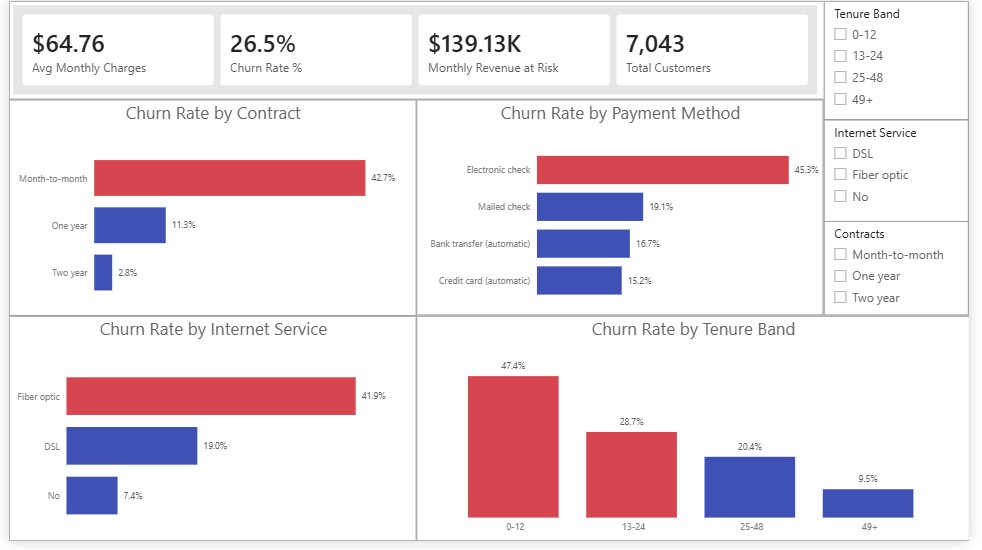
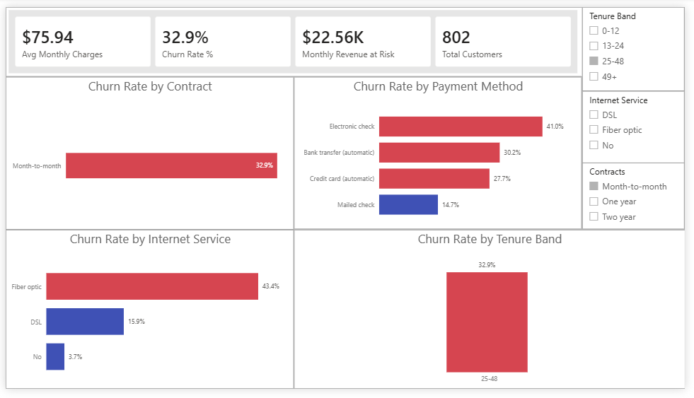
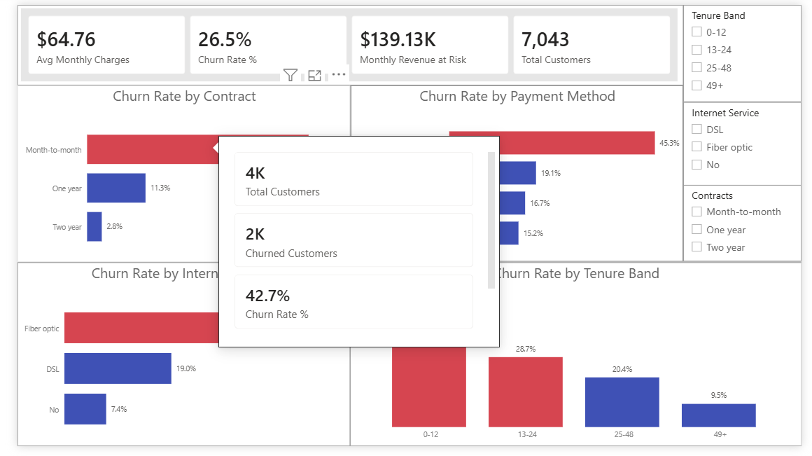
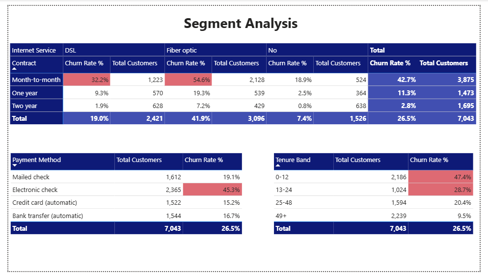
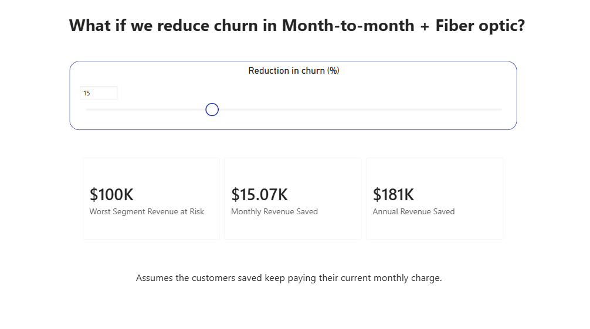

# Customer Churn Dashboard (Power BI)

An interactive churn dashboard built in Power BI Desktop for a retention manager. All data shaping is done in **Power Query** and all calculations in **DAX**.

**Dataset:** [Telco Customer Churn (Kaggle)](https://www.kaggle.com/datasets/blastchar/telco-customer-churn), 7,043 customers and 21 columns.
**Tool:** Power BI Desktop (Windows)

## Screenshots

### Churn Dashboard (no filters)



KPI cards, four churn-rate charts and three slicers. Red bars mark segments above the overall churn rate (26.5%).

### Slicer applied 



Selecting a slicer value cross-filters every card and chart on the page. 

### Tooltip on hover



Hovering over a bar opens a detail window with customers, churned customers, churn rate and monthly revenue at risk for that segment.

### Segment Analysis



Contract x Internet Service matrix with churn rate and customer count in every cell, plus detail tables for payment method and tenure band.

### What-if Scenario



A slider estimates the monthly and annual revenue saved if churn in the worst segment (Month-to-month + Fiber optic) drops by N%.

## Headline results

| Metric | Value |
|---|---|
| Total customers | 7,043 |
| Overall churn rate | 26.5% |
| Monthly revenue at risk | $139.13K |
| Average monthly charges | $64.76 |

| Segment | Churn rate | Customers |
|---|---|---|
| Month-to-month + Fiber optic | 54.6% | 2,128 |
| Tenure 0-12 months | 47.4% | 2,186 |
| Electronic check | 45.3% | 2,365 |

The biggest opportunity is customers on **month-to-month contracts with Fiber optic**: the highest churn rate and about 62% of all churn. Fiber customers on a two-year contract churn at only 7.2%, so the contract matters more than the internet type. The what-if page estimates that cutting churn in this segment by 20% would protect about $20K of monthly revenue (about $241K a year), before the cost of any retention offer.

## What was built

**Power Query**
- Explicit data type on every column
- Blank `TotalCharges` values (11 new customers with tenure = 0) replaced with 0, then converted to a number
- Calculated columns: `churn_flag`, `tenure_band`, `tenure_band_score` (sort key) and `charge_band` (quartiles of monthly charges)
- Applied steps named and kept in a logical order

**DAX measures**
- Total Customers, Churned Customers, Churn Rate %, Avg Monthly Charges, Monthly Revenue at Risk
- `DIVIDE` is used instead of `/` so an empty selection returns a blank and not an error
- Bonus measures: `Overall Churn Rate` and `Bar Color` (red/blue formatting), `Worst Segment Revenue at Risk` and `Monthly Revenue Saved` (what-if)

**Report pages**
- **Churn Dashboard**: 4 KPI cards, churn rate by Contract, Internet Service, Payment Method and Tenure Band, slicers for Contract, Internet Service and Tenure Band
- **Segment Analysis**: matrix and detail tables showing rate and volume together
- **What-if Scenario**: slider-driven revenue estimate
- **Tooltip - Segment Detail** (hidden): hover detail for the main charts

## Bonus features

| Bonus | Status |
|---|---|
| Conditional formatting (churn above average turns red) | Done |
| Matrix of Contract x InternetService | Done |
| Tooltip page | Done |
| What-if parameter | Done |
| Publish to Power BI Service | Not done (needs a work or school account) |

Full details of the decisions, the DAX formulas and the three prioritised recommendations are in [note.md](note.md).

## Repository contents

```
.
├── README.md
├── note.md
├── churn_dashboard.pbix
├── Telco-Customer-Churn.csv
└── dashboards/
    ├── dashboard_full.png
    ├── dashboard_filtered.png
    ├── tooltip_hover.png
    ├── segment_analysis.png
    └── whatif_scenario.png
```
